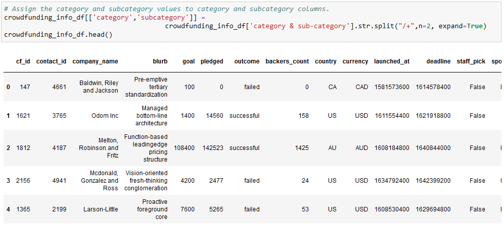
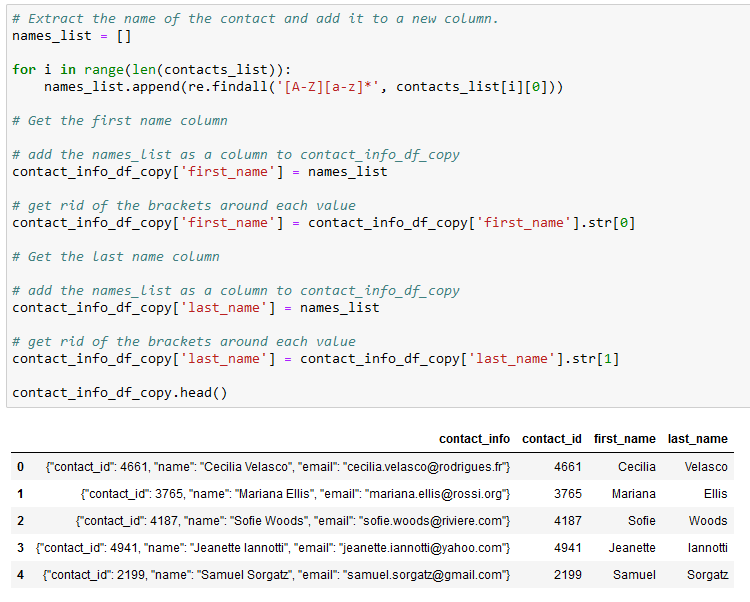

# Crowdfunding ETL Project
In this project we took data from 2 excel spreadsheets and read them into dataframes.

After reading the data into the dataframes, we looked at the data, and split the "category & sub-category" columns into their own separated columns.

We then assigned each unique category and subcategory a cat or subcat number using a list comprehension and exported the first database into a csv file.

We imported the data from the campaign file, cleaned it up and then merged the main database with the category and subcategory databases we had made, and then dropped all non relevant columns. 

Now that we had finished cleaning and preparing the campaigns database, we moved onto the contacts. We decided to go with the regex method to find the pertinent information. 
Armann used a slightly different method than was prescribed, and in his way creating a first name and last name column happened at the first step so there was no intermediary step. 

Through this project we extracted all relevant data, transformed it in ways that made it more useful and readable, and then we exported the 4 CSVs that we created, the load portion.